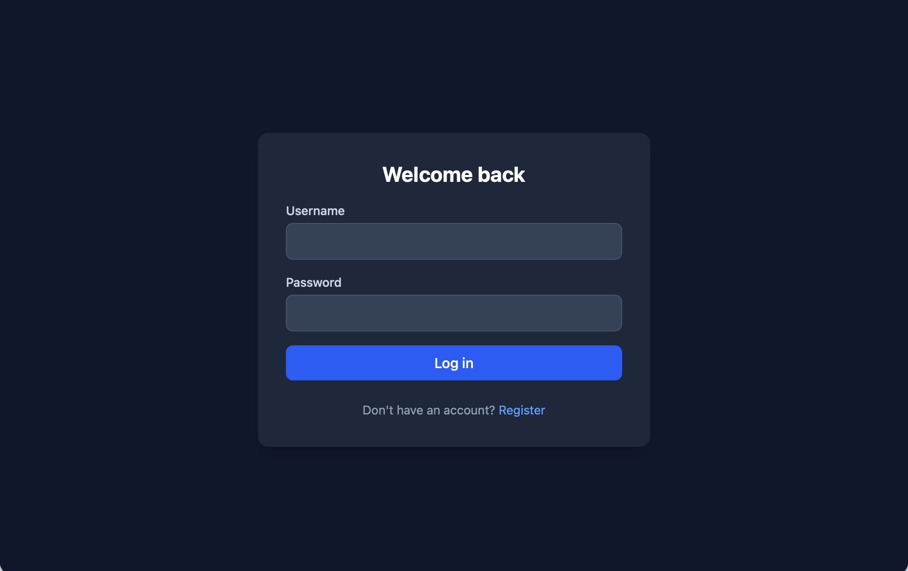
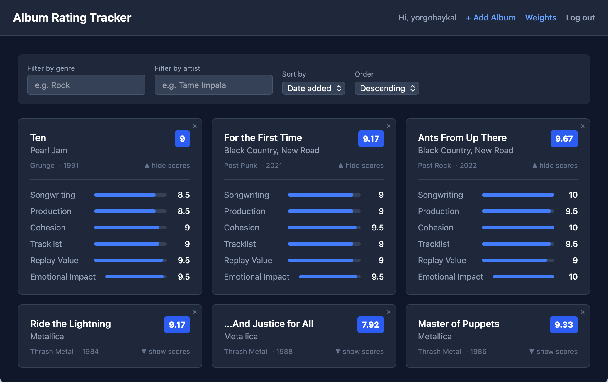
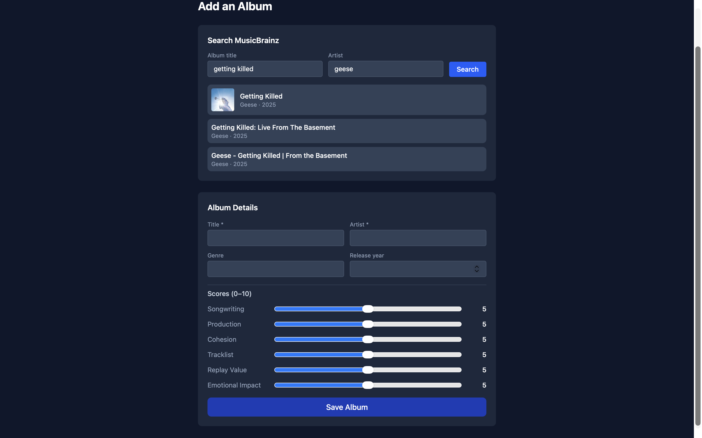
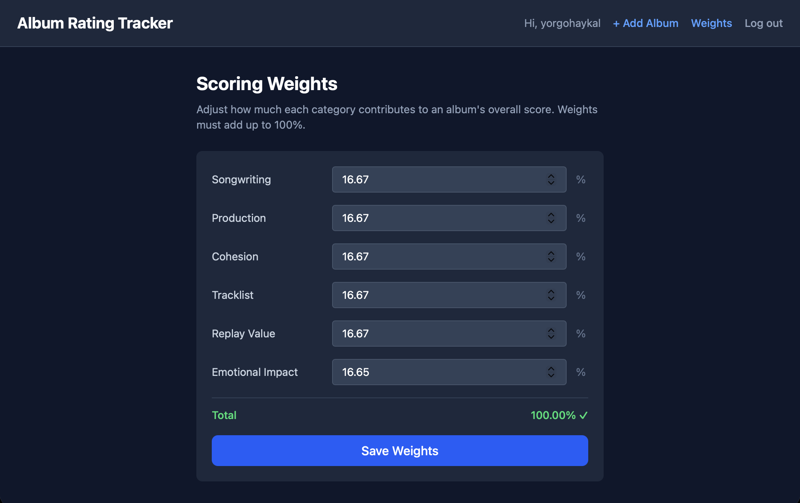

# Album Rating Tracker

A full-stack web application for logging and rating music albums using a custom
weighted-scoring system. Replaces a personal manual tracking process (spreadsheet)
with a proper tool — built as a portfolio project for internship applications.

**🔗 Live demo:** [https://album-rating-tracker-1.onrender.com](https://album-rating-tracker-1.onrender.com)

> Note: hosted on Render's free tier — the backend may take ~30-60 seconds to
> wake up on the first request if it's been idle.

## Screenshots






## Overview

Users add albums and rate them across six categories:

- Songwriting
- Production
- Cohesion
- Tracklist Quality
- Replay Value
- Emotional Impact

Each category has a **user-adjustable weight**, and the app auto-calculates a
final weighted score per album. Albums can be searched via the MusicBrainz API
for autofill, then browsed, filtered, and sorted by score, artist, genre, or
date added.

## Tech Stack

| Layer      | Technology                                          |
|------------|------------------------------------------------------|
| Backend    | Spring Boot (Java 21), Maven                          |
| Database   | PostgreSQL, Flyway migrations                          |
| Frontend   | React, Vite, Tailwind CSS                               |
| Auth       | JWT-based authentication                                 |
| External API | MusicBrainz + Cover Art Archive (album search/autofill)  |
| DevOps     | Docker, Docker Compose (local dev), GitHub Actions (CI)   |
| Hosting    | Render                                                      |

## Data Model

- **app_user** — registered users
- **scoring_weights** — one-to-one with user, holds the six adjustable category weights
- **album** — belongs to a user, holds the six raw category scores; weighted total is computed at query time

## Features

- [x] JWT authentication (register / login)
- [x] Add albums with scores across six weighted categories
- [x] MusicBrainz search integration for album autofill
- [x] Auto-calculated weighted total score
- [x] Browse / filter / sort rated albums (by score, artist, genre, date)
- [x] User-adjustable scoring weights
- [x] Delete albums
- [x] Unit-tested core logic (scoring, auth)
- [x] CI pipeline (GitHub Actions — tests + Docker build)
- [x] Deployed live

## Local Development

### Prerequisites

- Java 21+
- Maven
- Node.js + npm
- Docker

### Backend + Database

```bash
docker-compose up
```

This starts Postgres and the Spring Boot backend together, with Flyway
migrations running automatically.

### Frontend

```bash
cd frontend
npm install
npm run dev
```

The app will be available at `http://localhost:5173`, talking to the backend
at `http://localhost:8080`.

## Status

✅ MVP complete — deployed and fully functional.